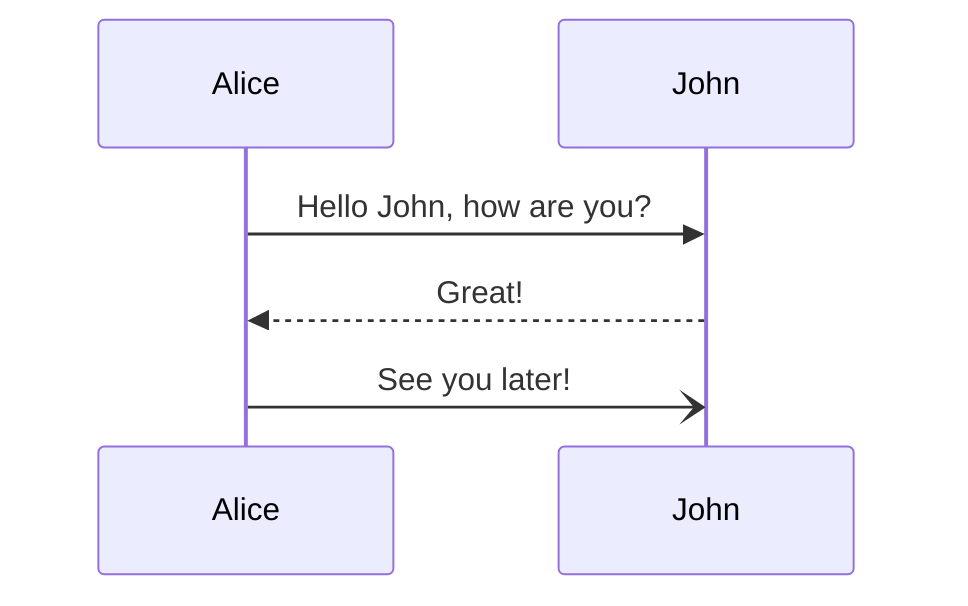
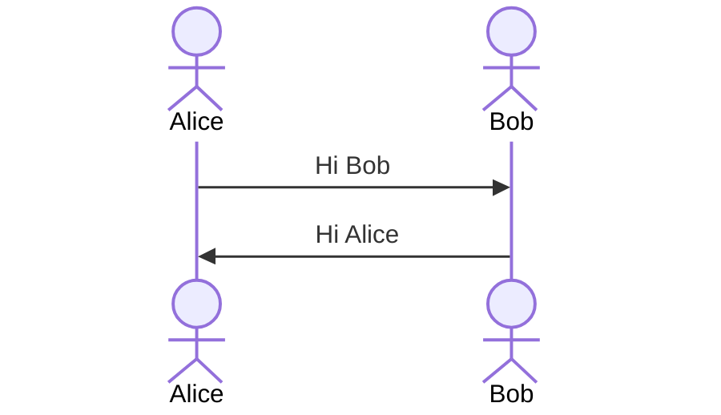
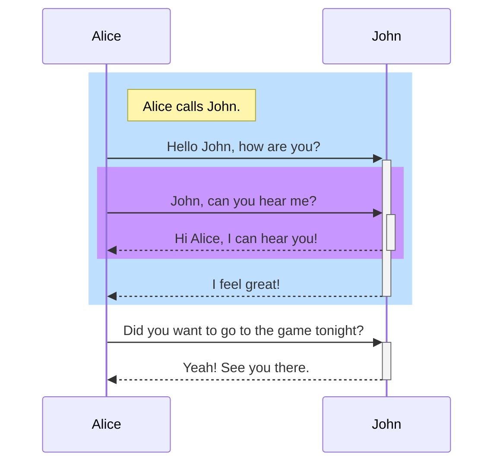
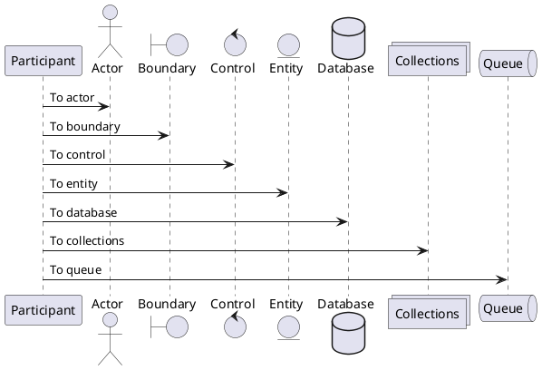

# Mermaid学习笔记

```mermaid
sequenceDiagram
    Alice->>John: Hello John, how are you?
    John-->>Alice: Great!
    Alice-)John: See you later! 
```

```mermaid
sequenceDiagram
    actor Alice
    actor Bob
    Alice->>Bob: Hi Bob
    Bob->>Alice: Hi Alice
```

```mermaid
sequenceDiagram
    participant Alice
    participant John

rect rgb(191, 223, 255)
note right of Alice: Alice calls John.
Alice->>+John: Hello John, how are you?
rect rgb(200, 150, 255)
Alice->>+John: John, can you hear me?
John-->>-Alice: Hi Alice, I can hear you!
end
John-->>-Alice: I feel great!
end
Alice ->>+ John: Did you want to go to the game tonight?
John -->>- Alice: Yeah! See you there.
```

```puml
@startuml
participant Participant as Foo
actor       Actor       as Foo1
boundary    Boundary    as Foo2
control     Control     as Foo3
entity      Entity      as Foo4
database    Database    as Foo5
collections Collections as Foo6
queue       Queue       as Foo7
Foo -> Foo1 : To actor 
Foo -> Foo2 : To boundary
Foo -> Foo3 : To control
Foo -> Foo4 : To entity
Foo -> Foo5 : To database
Foo -> Foo6 : To collections
Foo -> Foo7: To queue
@enduml
```